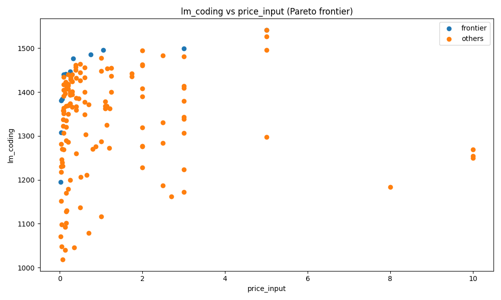

# Sweet-spot coding: quality per dollar

*2026-04-24T06:49:14Z by Showboat 0.6.1*
<!-- showboat-id: cc146e6c-c265-4b5e-a759-9b16b1ea12b0 -->

The `lanista pick` command hands the whole question to an LLM — great for nuance, wasteful for pure arithmetic. When the question is "best coding quality per dollar", the answer is just a Pareto frontier. This doc shows the deterministic path, captured for replay.

## The frontier

```bash
lanista pareto lm_coding price_input --max-cost 5 -n 10
```

```output
Pareto frontier (lm_coding ↑ vs price_input ↓) — 10 model(s):
  model                                          lm_coding     price_input
  llama-3-1-8b-instruct                            1195.23          0.0200
  gpt-oss-20b                                      1308.11          0.0300
  gpt-oss-120b                                     1380.30          0.0390
  glm-4-7-flash                                    1383.93          0.0600
  qwen3-next-80b-a3b-instruct                      1440.08          0.0900
  deepseek-v4-flash                                1440.50          0.1400
  deepseek-v3-2                                    1446.73          0.2520
  qwen3-6-plus                                     1475.97          0.3250
  kimi-k2-6                                        1486.03          0.7448
  glm-5-1                                          1496.17          1.0500

Next: lanista chart lm_coding price_input --out /tmp/pareto.png
```

Notice the shape: cost climbs ~50× across the frontier while quality climbs only ~25%. That's the diminishing-returns curve every cost-conscious team is looking at. The frontier rows are the *only* choices worth evaluating — everything else is strictly dominated.

## As a chart

```bash
lanista chart lm_coding price_input --max-cost 10 --out docs/sweetspot-coding.png --title 'lm_coding vs price_input (Pareto frontier)'
```

```output
/Users/mhild/src/durandom/b4arena/lanista/docs/sweetspot-coding.png
```

```bash {image}
docs/sweetspot-coding.png
```



## From frontier to three picks

A ten-row frontier is still too many for someone who just wants to *choose one model*. `lanista profiles` collapses it to three anchors — one per archetype:

```bash
lanista profiles lm_coding price_input --max-cost 5
```

```output
Frontier has 12 non-dominated model(s) over 141 candidate(s).
Filters: max-cost=5.0

Flagship    claude-opus-4-6                             lm_coding=1541.00  price_input=5.0000
            max lm_coding on the frontier
Balanced    qwen3-6-plus                                lm_coding=1475.97  price_input=0.3250
            knee of the curve (normalized distance to ideal)
Budget      llama-3-1-8b-instruct                       lm_coding=1195.23  price_input=0.0200
            min price_input on the frontier

Chart: lanista chart lm_coding price_input --out /tmp/profiles.png
```

Three defensible answers, each anchored to a number:

- **Flagship** `claude-opus-4-6` at the top of the frontier — pick this when quality is the only constraint.
- **Balanced** `qwen3-6-plus` at the knee of the curve — 96% of Opus's `lm_coding` for 6.5% of its price. This is the pick that *wouldn't surface in a naive top-3* because it's not the top of any single axis.
- **Budget** `llama-3-1-8b-instruct` at the floor — 250x cheaper than Flagship, with a measurable quality floor.

The knee uses min-max normalization over the frontier so that relative jumps on each axis are comparable. Without it, whichever axis had the wider absolute range (always price here) would dominate the "closest to ideal" calculation.

## Complementary to `lanista pick`

`pareto` and `profiles` can't cite practitioner opinions — "GLM-5.1 ran unattended for 8 hours" lives in a blog post, not a benchmark column. Use the arithmetic tools to shortlist, then run `lanista pick` to reason over the survivors with citations. See [workflows.md](workflows.md) for the three-lens story.
