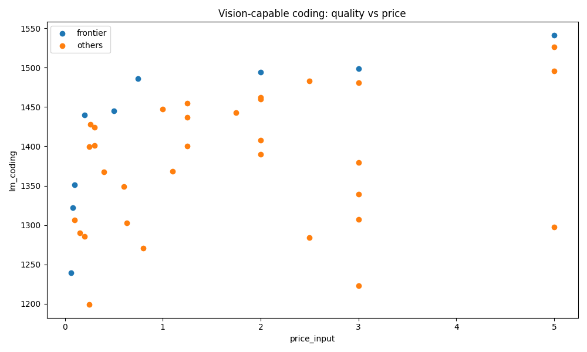

# Three lenses for picking a model

*2026-04-24T09:29:09Z by Showboat 0.6.1*
<!-- showboat-id: 9d307869-9ba8-40b4-b61d-0799b5172eec -->

lanista's index carries 2700+ models. You can't read them all, and no single answer fits every question. This doc walks the three complementary tools for narrowing the catalog — and names honestly what each one misses.

## Lens 1 — `pareto`: the honest math

The simplest question — "best quality per dollar" — is pure arithmetic. A Pareto frontier keeps only the non-dominated models: for each surviving row, no other model beats it on both axes at once. Everything else is strictly worse and can be dropped without thinking.

```bash
lanista pareto lm_coding price_input --max-cost 1 -n 8
```

```output
Pareto frontier (lm_coding ↑ vs price_input ↓) — 8 model(s):
  model                                          lm_coding     price_input
  llama-3-1-8b-instruct                            1195.23          0.0200
  gpt-oss-20b                                      1308.11          0.0300
  gpt-oss-120b                                     1380.30          0.0390
  glm-4-7-flash                                    1383.93          0.0600
  qwen3-next-80b-a3b-instruct                      1440.08          0.0900
  deepseek-v4-flash                                1440.50          0.1400
  deepseek-v3-2                                    1446.73          0.2520
  qwen3-6-plus                                     1475.97          0.3250

Next: lanista chart lm_coding price_input --out /tmp/pareto.png
```

Eight rows from 2700. That's the value of deterministic filtering: the diminishing-returns curve is visible at a glance, and you know with certainty that no other sub-$1/Mtok model is better on coding.

**What `pareto` blinds you to:** practitioner sentiment, benchmarks that aren't yet in the index (agent-harness scores, long-horizon stability), and single-number surprises like "this 8B model punches above its weight on your specific workflow."

## Lens 2 — `profiles`: three anchor picks on the frontier

A frontier is honest but overwhelming — eight rows is still too many to hand to a reader who just wants to *pick one*. `profiles` collapses the frontier into three anchored recommendations, one per archetype:

- **Flagship** — max quality on the frontier (money no object)
- **Balanced** — knee of the curve (best compromise, normalized to ideal corner)
- **Budget** — min cost on the frontier (cheapest floor)

The knee uses min-max normalization over the frontier so a 1500→1501 Elo jump and a $5→$6 price jump are treated on the same scale. Without normalization the wider-range axis would always win.

### Example — screenshot-to-code

Task: *turn a Figma screenshot into production React components.* This is a trade-off on two axes (quality × price) with a hard filter (must accept image input). One command:

```bash
lanista profiles lm_coding price_input --require-cap vision
```

```output
Frontier has 9 non-dominated model(s) over 46 candidate(s).
Filters: require-cap=vision

Flagship    claude-opus-4-6                             lm_coding=1541.00  price_input=5.0000
            max lm_coding on the frontier
Balanced    kimi-k2-6                                   lm_coding=1486.03  price_input=0.7448
            knee of the curve (normalized distance to ideal)
Budget      amazon-nova-lite-v1-0                       lm_coding=1239.23  price_input=0.0600
            min price_input on the frontier

Chart: lanista chart lm_coding price_input --out /tmp/profiles.png
```

Three genuinely different answers, each defensible for a different reader:

- **`claude-opus-4-6`** — if the screenshots are high-stakes and budget doesn't matter.
- **`kimi-k2-6`** — pays 15% of Opus's price for 96% of its coding score. The *insight* here: Kimi wouldn't have surfaced in a top-3 ranking because it's not the top model on any single axis. The knee detection specifically rewards it for being the best *compromise*.
- **`amazon-nova-lite-v1-0`** — 83x cheaper than Opus, with a quality floor you can measure.

That's something the LLM-based picker can't do: it can rank, but it can't tell you *which of three answers is right for you* without re-asking.

```bash
lanista chart lm_coding price_input --require-cap vision --max-cost 6 --out docs/workflows-vision.png --title 'Vision-capable coding: quality vs price'
```

```output
/Users/mhild/src/durandom/b4arena/lanista/docs/workflows-vision.png
```

```bash {image}
docs/workflows-vision.png
```



The chart makes the knee visible: the frontier bends sharply between Budget and Balanced, then flattens out. Kimi K2.6 sits right at the bend — you pay 12x Nova Lite's price for a 247-point quality jump, but pay another 7x Kimi's price for only 55 more points going to Opus.

**What `profiles` blinds you to:** same blind spots as `pareto`, plus it imposes a specific *tri-archetype* framing that might not match your question. If you actually want five options (say, across a continuum of budgets), drop back to `pareto` and read the frontier directly.

## Lens 3 — `pick`: LLM synthesis with citations

Some questions can't be answered with arithmetic at all. "Run an autonomous coding agent for 8 hours of continuous refactoring" — there's no `reliability` column in the index. The signal lives in curated tier notes (`gkisokay`'s T1 models flagged for specific use-cases) and practitioner blog posts. `pick` builds a self-contained prompt that forces the answering LLM to cite its claims:

```bash
lanista pick 'run an autonomous coding agent for 8 hours of continuous refactoring work' 2>/dev/null | sed -n '1,20p'
```

```output
# lanista model-picker prompt — self-contained.
# If you are an LLM reading this (e.g. a coding agent that just ran
# `lanista pick ...` on the user's behalf), answer it directly using
# only the CATALOG and OPINIONS below. Follow the INSTRUCTIONS at the
# end. Do not call lanista again — everything you need is in this prompt.

TASK: run an autonomous coding agent for 8 hours of continuous refactoring work

Opinion corpus has 40 recent entries.

CATALOG (top 60 by best available LMArena rating; price is $/Mtok input/output; modalities uses txt/img/aud/vid/pdf; caps uses pdf/cu/fn/vis/think; tier is curated 1=frontier..4=local; lm_* columns are LMArena Elo ratings by category; '-' means no data):
| model | price_$/Mtok | ctx | aider | modalities | caps | tier | lm_overall | lm_coding | lm_writing | lm_hard | lm_long | lm_english | lm_chinese | lm_document |
|---|---|---|---|---|---|---|---|---|---|---|---|---|---|---|
| claude-opus-4-6-thinking | 5/25 | 200000 | - | txt+img | - | - | 1500 | 1541 | 1498 | 1530 | 1524 | 1513 | 1543 | 1528 |
| claude-opus-4-6 | 5.0/25.0 | 1000000 | - | txt+img | cu,fn,pdf,think,vis | - | 1495 | 1541 | 1477 | 1528 | 1521 | 1504 | 1550 | 1520 |
| gemini-3-1-pro | 2.0/12.0 | 1048576 | - | aud+file+img+txt+vid | fn,pdf,think,vis | 3 | 1488 | 1495 | 1490 | 1494 | 1489 | 1484 | 1545 | 1451 |
| claude-opus-4-7-thinking | - | - | - | - | - | - | 1488 | 1539 | 1489 | 1505 | 1507 | 1494 | 1552 | 1515 |
| claude-opus-4-7 | 5.0/25.0 | 1000000 | - | txt+img | cu,fn,pdf,think,vis | 1 | 1480 | 1527 | 1476 | 1496 | 1510 | 1492 | 1540 | 1523 |
| gemini-3-pro | - | - | - | - | - | - | 1479 | 1483 | 1483 | 1482 | 1473 | 1480 | 1528 | 1443 |
| muse-spark | - | - | - | - | - | - | 1477 | 1484 | 1456 | 1480 | 1444 | 1481 | 1520 | 1457 |
```

The head of the prompt shows the enriched catalog: `modalities`, `caps`, and `tier` columns now let the answering LLM filter by capability without guessing. And below the table, a new block:

```bash
lanista pick 'run an autonomous coding agent for 8 hours of continuous refactoring work' 2>/dev/null | grep -A 6 'TIER 1/2'
```

```output
TIER 1/2 USE-CASE NOTES (curated — cite via `tier` + model id):
[tier 1] claude-opus-4-7: Complex external dev via Claude Code, multi-file refactoring, vision-heavy agentic workflows
[tier 1] glm-5-1: Long-horizon agentic coding, sustained optimization loops
[tier 1] gpt-5-4: External Codex-driven complex features, terminal-heavy workflows
[tier 2] mimo-v2-pro: Agent orchestration brain, custom OpenClaw workflows, long-context agent sessions
[tier 2] deepseek-v3-2: Cost-floor frontier reasoning, high-volume coding

```

Before this block existed, `pick` would miss GLM-5.1 on the long-horizon question — LMArena rates it #8 on `lm_coding`, so the LLM had no signal that it was *specifically* designed for 8-hour runs. See [docs/scenarios/06-long-horizon-agent.md](scenarios/06-long-horizon-agent.md) for the before/after evidence.

**What `pick` blinds you to:** the trade-off shape. It gives you a ranked top-N, not a frontier; it can't tell you where the knee is, and it can't filter by a hard constraint like "must have pdf_input" without leaning on the answering LLM to do the right thing. For "balanced" / "cheapest" / "fastest" questions, `pareto` and `profiles` will be more honest.

## The hybrid flow

The sharpest answers use arithmetic *and* prose reasoning together:

1. **Narrow with `profiles`** — get three defensible candidates per budget archetype, filtered by hard constraints (capability, context window).
2. **Reason with `pick`** — hand the question to an LLM that can cite practitioner opinions and tier notes for the surviving shortlist.

This is what `pick`'s built-in routing hint nudges you toward when you phrase a task as a trade-off. If you type `lanista pick 'balanced pick for long-context TypeScript review'`, the command prints the picker prompt *and* a stderr hint:

```bash
lanista pick 'balanced pick for long-context TypeScript review' >/dev/null 2>&1; lanista pick 'balanced pick for long-context TypeScript review' 2>&1 >/dev/null
```

```output
# Tip: this looks like a trade-off with multiple acceptable answers. Try: lanista profiles lm_coding price_input
```

That hint lives on stderr — piping `lanista pick` into an LLM won't pollute the prompt, but a human reading the terminal sees it.

## Summary: when to use which

| Question shape | Use | Why |
|---|---|---|
| "Cheapest model that beats X on Y" | `pareto` | Full frontier, no archetype framing |
| "What should I pick — one model?" with a budget axis | `profiles` | Three anchors beat a ranked top-3 for trade-off questions |
| "Which model for <task>?" with prose nuance | `pick` | LLM can cite opinions; tier notes surface curated signal |
| All of the above | filter with `profiles`, reason with `pick` | Deterministic shortlist + narrative justification |
